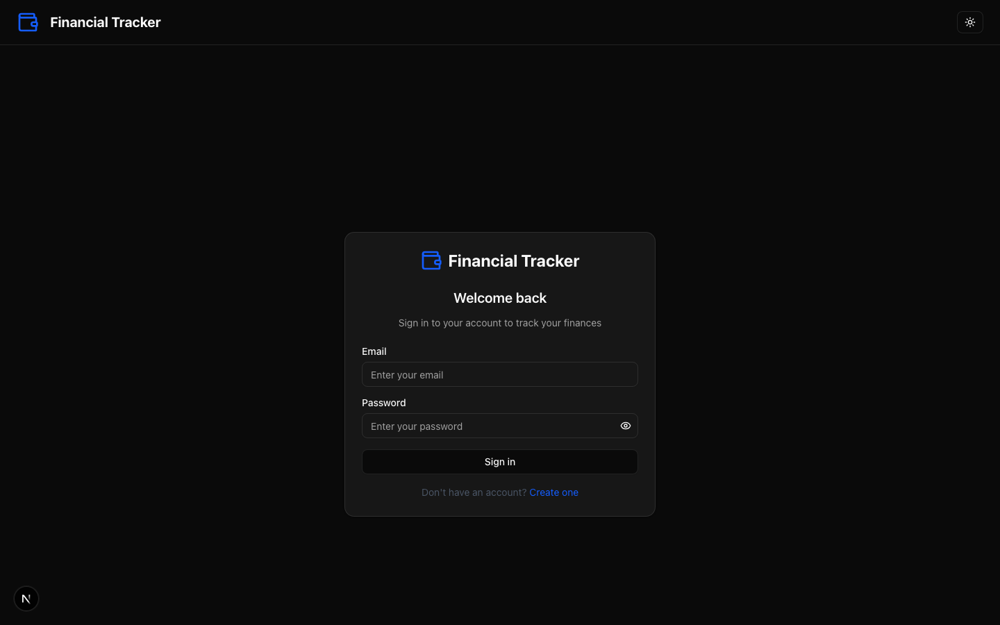
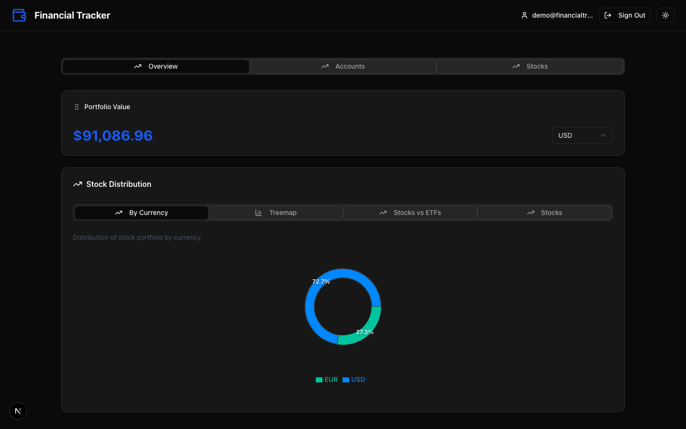
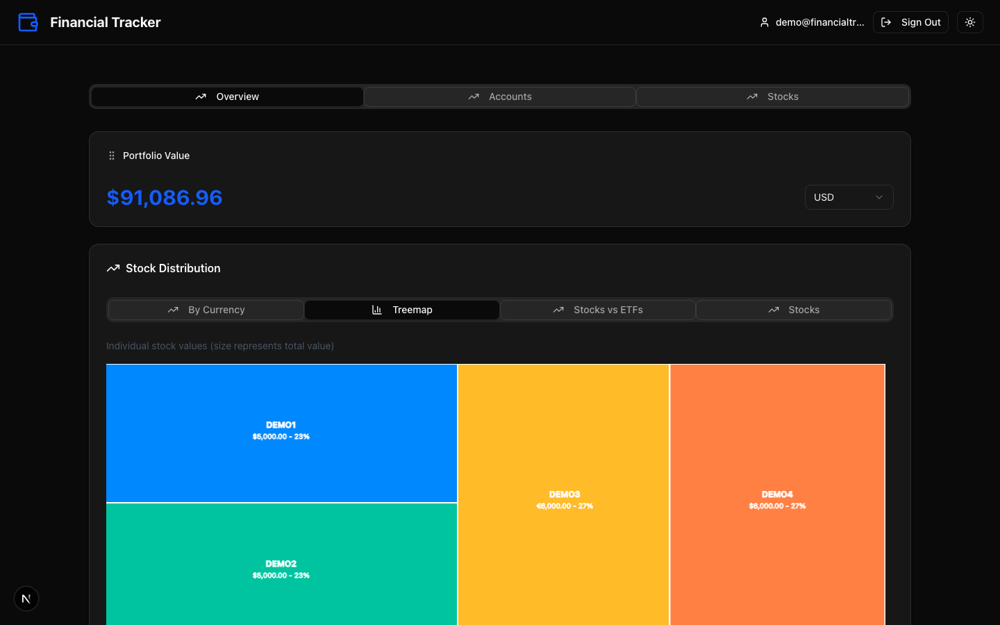
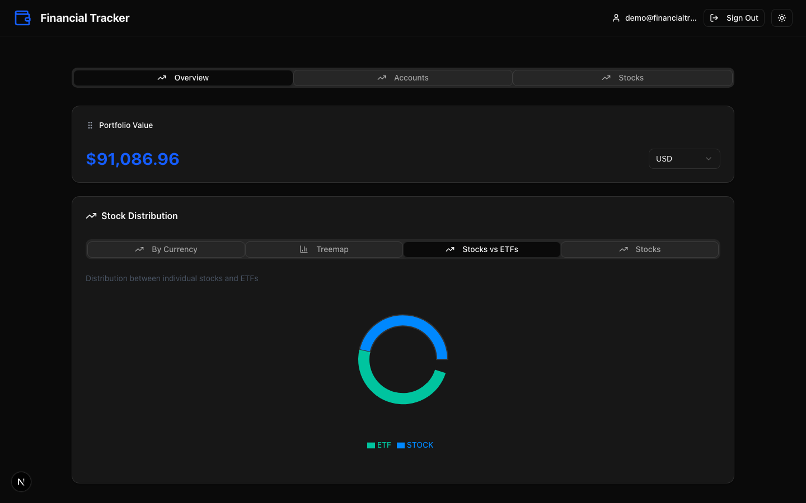
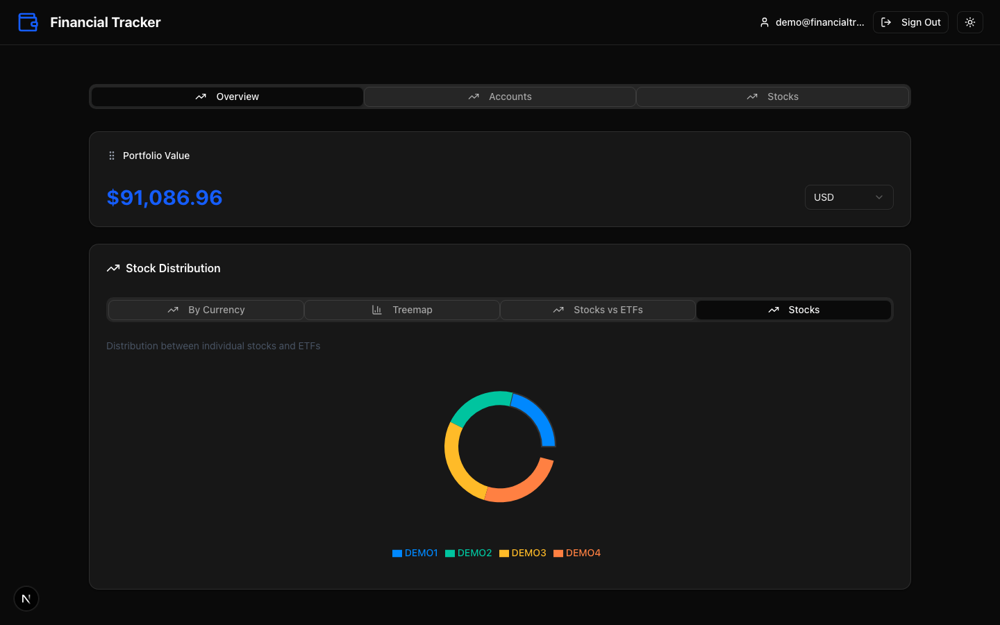
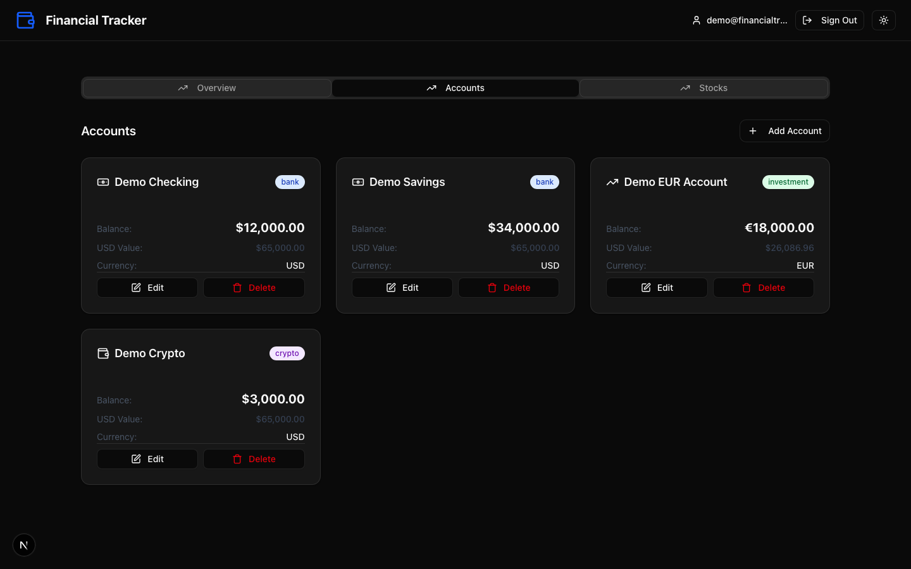
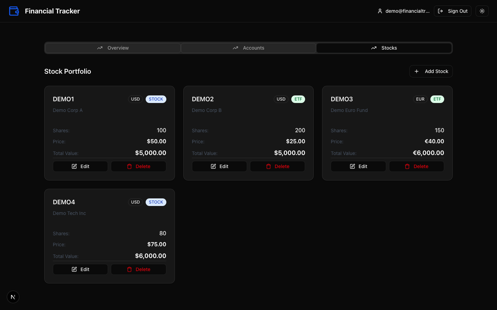

# Financial Tracker

A personal finance dashboard built with Next.js, AWS DynamoDB, and real-time market data. Track bank accounts, investment portfolios, stock positions, transactions, and budgets across multiple currencies — all in one place.

> Screenshots below use demo data only — no real financial information is shown.

## Screenshots

### Login



### Dashboard Overview



### Stock Distribution — By Currency


### Stock Distribution — Treemap



### Stock Distribution — Stocks vs ETFs



### Stock Distribution — Individual Stocks



### Accounts



### Stock Portfolio



## Features

- **Multi-currency support** — track accounts and stocks in USD, EUR, GBP, and more; totals converted to a single base currency
- **Portfolio overview** — draggable widget showing total portfolio value
- **Net worth over time** — area chart of daily net worth snapshots
- **Stock distribution charts** — pie by currency, treemap, Stocks vs ETFs, and per-stock breakdowns
- **P&L and cost basis** — set average purchase price per share to track unrealized gain/loss per position
- **Account management** — add, edit, and delete bank, investment, crypto, and cash accounts
- **Stock portfolio management** — add, edit, and delete stock positions with live price refresh (Alpha Vantage)
- **Transaction history** — log income, expenses, and transfers with category tagging
- **Budget management** — create monthly/weekly spending budgets with progress tracking
- **Pagination** — accounts and stocks tabs paginate at 6 items per page
- **Optimistic UI** — all CRUD operations update the UI immediately and roll back on error
- **Error boundaries** — each dashboard tab is isolated; one failing component does not break the rest
- **API rate limiting** — in-memory rate limiting on all API routes (60 req/min; 5 req/min for registration)
- **Authentication** — credential-based login with bcrypt password hashing and JWT sessions
- **OAuth sign-in** — Google and GitHub
- **Email verification** — new accounts receive a verification link; unverified users see a dismissible banner
- **Password reset** — forgot-password flow sends a time-limited reset link via email
- **User registration** — sign up with email and password (stored in DynamoDB)
- **Persistent storage** — all data stored in AWS DynamoDB via server-side API routes
- **React Server Components** — initial accounts and stocks are fetched server-side, eliminating the loading flash
- **Dark / light mode** — persisted per user in `localStorage`
- **Demo mode** — works fully without DynamoDB configured (in-memory demo data)

## Tech Stack

| Layer           | Technology                           |
| --------------- | ------------------------------------ |
| Framework       | Next.js 16 (App Router, RSC)         |
| UI              | React 19, Tailwind CSS v4, shadcn/ui |
| Charts          | Recharts                             |
| Auth            | NextAuth v4, bcryptjs                |
| Database        | AWS DynamoDB                         |
| Email           | nodemailer (SMTP)                    |
| Validation      | Zod                                  |
| Package manager | pnpm                                 |
| CI              | GitHub Actions                       |
| Testing         | Jest (unit), Playwright (E2E)        |

## Getting Started

### Prerequisites

- Node.js 20+
- pnpm
- AWS account with DynamoDB tables (see [DynamoDB setup](#dynamodb-setup)) — optional, app runs in demo mode without it

### Installation

```bash
pnpm install
cp .env.dist .env.local
# Edit .env.local with your values
```

### Environment Variables

`.env.dist` contains every supported variable with inline documentation. The minimum required set to run locally:

```env
NEXTAUTH_SECRET=any-random-string
NEXTAUTH_URL=http://localhost:3000
```

All other variables are optional — AWS credentials enable persistence, SMTP enables email, OAuth keys enable social login.

### Run locally

```bash
pnpm dev
```

Open [http://localhost:3000](http://localhost:3000).

**Demo credentials** (always work, even without AWS): `demo@financialtracker.com` / `demo123`

## DynamoDB Setup

Create all seven tables with the AWS CLI:

```bash
# Users
aws dynamodb create-table \
  --table-name finance-tracker-users \
  --attribute-definitions AttributeName=userId,AttributeType=S \
  --key-schema AttributeName=userId,KeyType=HASH \
  --billing-mode PAY_PER_REQUEST

# Accounts
aws dynamodb create-table \
  --table-name finance-tracker-accounts \
  --attribute-definitions AttributeName=id,AttributeType=S AttributeName=userId,AttributeType=S \
  --key-schema AttributeName=id,KeyType=HASH \
  --global-secondary-indexes '[{"IndexName":"userId-index","KeySchema":[{"AttributeName":"userId","KeyType":"HASH"}],"Projection":{"ProjectionType":"ALL"},"BillingMode":"PAY_PER_REQUEST"}]' \
  --billing-mode PAY_PER_REQUEST

# Stocks
aws dynamodb create-table \
  --table-name finance-tracker-stocks \
  --attribute-definitions AttributeName=symbol,AttributeType=S AttributeName=userId,AttributeType=S \
  --key-schema AttributeName=symbol,KeyType=HASH \
  --global-secondary-indexes '[{"IndexName":"userId-index","KeySchema":[{"AttributeName":"userId","KeyType":"HASH"}],"Projection":{"ProjectionType":"ALL"},"BillingMode":"PAY_PER_REQUEST"}]' \
  --billing-mode PAY_PER_REQUEST

# Currency rates
aws dynamodb create-table \
  --table-name finance-tracker-rates \
  --attribute-definitions AttributeName=fromCurrency,AttributeType=S AttributeName="toCurrency#timestamp",AttributeType=S \
  --key-schema AttributeName=fromCurrency,KeyType=HASH AttributeName="toCurrency#timestamp",KeyType=RANGE \
  --billing-mode PAY_PER_REQUEST

# Transactions
aws dynamodb create-table \
  --table-name finance-tracker-transactions \
  --attribute-definitions AttributeName=transactionId,AttributeType=S AttributeName=userId,AttributeType=S AttributeName=date,AttributeType=S \
  --key-schema AttributeName=transactionId,KeyType=HASH \
  --global-secondary-indexes '[{"IndexName":"userId-index","KeySchema":[{"AttributeName":"userId","KeyType":"HASH"},{"AttributeName":"date","KeyType":"RANGE"}],"Projection":{"ProjectionType":"ALL"},"BillingMode":"PAY_PER_REQUEST"}]' \
  --billing-mode PAY_PER_REQUEST

# Net worth snapshots
aws dynamodb create-table \
  --table-name finance-tracker-snapshots \
  --attribute-definitions AttributeName=snapshotId,AttributeType=S AttributeName=userId,AttributeType=S AttributeName=date,AttributeType=S \
  --key-schema AttributeName=snapshotId,KeyType=HASH \
  --global-secondary-indexes '[{"IndexName":"userId-index","KeySchema":[{"AttributeName":"userId","KeyType":"HASH"},{"AttributeName":"date","KeyType":"RANGE"}],"Projection":{"ProjectionType":"ALL"},"BillingMode":"PAY_PER_REQUEST"}]' \
  --billing-mode PAY_PER_REQUEST

# Budgets
aws dynamodb create-table \
  --table-name finance-tracker-budgets \
  --attribute-definitions AttributeName=budgetId,AttributeType=S AttributeName=userId,AttributeType=S \
  --key-schema AttributeName=budgetId,KeyType=HASH \
  --global-secondary-indexes '[{"IndexName":"userId-index","KeySchema":[{"AttributeName":"userId","KeyType":"HASH"}],"Projection":{"ProjectionType":"ALL"},"BillingMode":"PAY_PER_REQUEST"}]' \
  --billing-mode PAY_PER_REQUEST
```

See `DYNAMODB_TABLES.md` for full schema documentation including GSI definitions and example items.

## Commands

```bash
pnpm dev            # Start dev server
pnpm build          # Production build
pnpm lint           # ESLint
pnpm format         # Prettier
pnpm test           # Unit tests
pnpm test:coverage  # Unit tests with coverage
pnpm test:e2e       # Playwright E2E tests
```

## Project Structure

```
src/
├── app/
│   ├── api/
│   │   ├── accounts/         # CRUD for bank/investment accounts
│   │   ├── stocks/           # CRUD for stock positions
│   │   ├── transactions/     # CRUD for income/expense/transfer records
│   │   ├── snapshots/        # Daily net worth snapshot upsert
│   │   ├── budgets/          # CRUD for spending budgets
│   │   ├── rates/            # Currency rate cache
│   │   └── auth/             # register, verify-email, resend-verification,
│   │                         # forgot-password, reset-password, [...nextauth]
│   ├── dashboard/
│   │   ├── page.tsx          # Async RSC — fetches initial data server-side
│   │   ├── loader.ts         # Server-only DynamoDB fetch (accounts + stocks)
│   │   └── DashboardClient.tsx  # 'use client' — all interactive dashboard logic
│   ├── login/                # Login page (credentials + OAuth + banners)
│   ├── register/             # Registration page
│   ├── forgot-password/      # Password reset request page
│   └── reset-password/       # Password reset form (token from email)
├── components/
│   ├── charts/               # NetWorthChart (AreaChart), StockDistribution
│   ├── account/              # AccountCard, AccountForm
│   ├── stock/                # StockCard (with P&L), StockForm (with costBasis)
│   ├── transaction/          # TransactionList, TransactionForm
│   ├── budget/               # BudgetCard (with progress bar), BudgetForm
│   ├── ErrorBoundary.tsx     # React class component; wraps each dashboard tab
│   └── ui/                   # shadcn/ui primitives + Pagination
├── hooks/
│   ├── useFinancialDataWithDynamo.ts  # Primary data hook (optimistic updates, RSC-aware)
│   └── usePagination.ts              # Client-side pagination helper
├── lib/
│   ├── auth.ts               # NextAuth config (Credentials, Google, GitHub)
│   ├── auth-dynamo.ts        # DynamoDB user helpers
│   ├── calculations.ts       # FinancialCalculator (totals, P&L)
│   ├── email-verification.ts # Token creation/validation for email verification
│   ├── password-reset.ts     # Token creation/validation for password reset
│   ├── mailer.ts             # nodemailer wrappers (verification + reset emails)
│   ├── rate-limit.ts         # In-memory rate limiter
│   ├── with-rate-limit.ts    # Route handler wrapper applying rate limiting
│   └── api.ts                # Alpha Vantage + Open Exchange Rates clients
└── types/
    ├── index.ts              # Account, Stock, Transaction, Budget, NetWorthSnapshot, …
    └── tab.ts                # TabConfig, TabComponentProps
```
